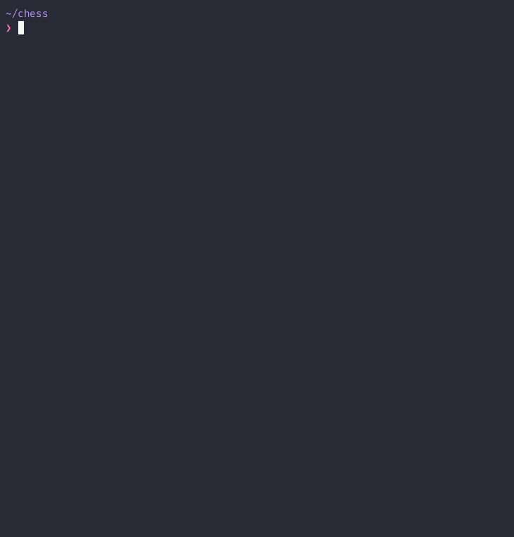

# `chess`
A chess engine written in Rust, using the classical [alpha-beta pruning](https://en.wikipedia.org/wiki/Alpha–beta_pruning) algorithm for best-move selection.



## Installation

Clone this repository, and then run:

```shell
cargo install --path .
```

Once installed, you can run the engine with `chess`, so long as you have the `chess` binary in your `PATH` (e.g. `export PATH="$PATH:$HOME/.cargo/bin"`).

## Usage

```console
$ chess --help
chess 1.0.0
A classical chess engine implemented in Rust ♛

USAGE:
    chess <SUBCOMMAND>

FLAGS:
    -h, --help       Prints help information
    -V, --version    Prints version information

SUBCOMMANDS:
    calculate-best-move        Use the chess engine to determine the best move from a given position, provided in
                               FEN notation with `--fen` (required). You can optionally specify the depth of the
                               search with the `--depth` arg (default: 4).
    count-positions            Count the number of possible positions for a given `--depth` (default: 4), and
                               reports the time it took to do so. By default, this searches all possible positions.
                               The routine can be run with alpha-beta pruning by selecting `--strategy alpha-beta`.
    determine-stockfish-elo    Determine the ELO rating of the engine at a given `--depth` (default: 4) and
                               `--starting-elo` (default: 1000). The engine will increment the Stockfish ELO until
                               it plateaus at a 50% win rate, at which point the rating is reported.
    help                       Prints this message or the help of the given subcommand(s)
    play                       Play a game against the computer, which will search for the best move using alpha-
                               beta pruning at the given `--depth` (default: 4). Your starting color will be
                               chosen at random unless you specify with `--color`. The initial position can be
                               specified using FEN notation with `--fen` (default: starting position).
    pvp                        Play a game against another human on this local machine. The initial position can be
                               specified using FEN notation with `--fen` (default: starting position).
    watch                      Watch the computer play against itself at the given `--depth` (default: 4). The
                               initial position can be specified using FEN notation with `--fen` (default: starting
                               position).

```

### Starting from a custom position

You can start a game from any valid chess position by specifying it in FEN (Forsyth–Edwards Notation) format. For example:

```console
$ chess play --fen "rnbqkbnr/pp1ppppp/8/2p5/4P3/5N2/PPPP1PPP/RNBQKB1R b KQkq - 1 2"
```

This starts a game from the Sicilian Defense position after 1.e4 c5 2.Nf3. The default starting position is used if no FEN is specified.

The `--fen` parameter is available for the `play`, `pvp`, and `watch` commands. Each command will validate the FEN string and ensure it represents a legal chess position before starting the game.


### Calculating the best move from a given position

There is also the option to calculate the best move from a given position. For example:

```console
$ chess calculate-best-move --fen "1Q6/8/8/8/8/k1K5/8/8 w - - 0 1"
Qb3#
```

This evaluates the position using the engine at a default `--depth` of `4`, and writes the result to `stdout` in algebraic notation.

## Performance

### Throughput

On an M1 MacBook Pro, the engine plateaus at around 45 million positions per second.

```console
$ chess count-positions --depth 6
depth: 0, positions: 20, positions per second: 344827.5862068965
depth: 1, positions: 420, positions per second: 36910.09754811495
depth: 2, positions: 9322, positions per second: 924159.8096559928
depth: 3, positions: 206603, positions per second: 7812258.942751266
depth: 4, positions: 5072262, positions per second: 30028309.929195575
depth: 5, positions: 124135208, positions per second: 44738631.82584201
depth: 6, positions: 3320182902, positions per second: 44980862.13103737
total positions: 3449606737, total duration: 76.804796s, positions per second: 44913949.6054387
```

This is a pure depth-first search of all possible positions - no pruning is applied.

[Alpha-beta pruning](https://en.wikipedia.org/wiki/Alpha–beta_pruning), which incorporates the engine's scoring heuristic to prune branches of the search tree, is used to search for the "best" move in actual gameplay. Using this approach, the engine plateaus at around 900,000 positions per second:

```console
❯ chess count-positions --depth 6 --strategy alpha-beta
depth: 0, positions: 20, positions per second: 1125.4924029262802
depth: 1, positions: 420, positions per second: 32218.471923903035
depth: 2, positions: 4434, positions per second: 254359.79807251034
depth: 3, positions: 19494, positions per second: 588444.8200917653
depth: 4, positions: 501500, positions per second: 927077.8837852877
depth: 5, positions: 1122179, positions per second: 869289.6124067038
depth: 6, positions: 26710588, positions per second: 951893.6850460902
total positions: 28358635, total duration: 29.973702s, positions per second: 946117.1996705646
```

These figures vary by hardware. To achieve the best performance, make sure to use the release build, which leverages [compiler optimizations](./Cargo.toml#L28-L33):

### Gameplay

To measure the engine's performance in actual gameplay, use the `determine-stockfish-elo` subcommand. This will increment the Stockfish ELO until it plateaus at a 50% win rate, at which point the rating is reported.

```sh
chess determine-stockfish-elo --depth 6 --starting-elo 2000
```

At alpha-beta search depth 6, you can observe the engine winning against Stockfish playing at a 2000 ELO.

## Implementation details

There are numerous optimizations used to increase the engine's performance. This list is not exhaustive, but should give you a sense of the techniques used:
* The board state is represented as a [64 bit integer](common/src/bitboard/bitboard.rs). This enables the engine to leverage the CPU's bitwise operations to quickly calculate moves, attacks, and other common board state changes.
* [Alpha-beta pruning](https://en.wikipedia.org/wiki/Alpha–beta_pruning) is used to quickly eliminate branches of the [search tree](src/alpha_beta_searcher/mod.rs) that are unlikely to lead to a winning position. The move order is sorted in an attempt to prioritize the "best" moves first, so that worse moves come later in the search and are therefore pruned (and not searched entirely), reducing the search space/time.
* The [Zobrist hashing](./precompile/src/zobrist/mod.rs) tables are generated at compile time using the [precompile](./precompile/src/main.rs) build script. This hashing approach enables quick incremental hashing of the board state so that various computations can be cached (e.g. move generation) by the engine during gameplay.
* Macros are used throughout the codebase to improve the developer experience. See below for one example.

```rust
// The `chess_position!` macro is used to instantiate a board state from
// an ascii representation of the board. For example, here is the starting
// position:

let board = chess_position! {
    rnbqkbnr
    pppppppp
    ........
    ........
    ........
    ........
    PPPPPPPP
    RNBQKBNR
}

// This is used extensively in tests, where various positions are instantiated
// to exercise the engine's logic with.

```rust
#[test]
fn test_find_back_rank_mate_in_2_black() {
    let mut context = SearchContext::new(4);

    let mut board = chess_position! {
        ....r..k
        ....q...
        ........
        ........
        ........
        ........
        .....PPP
        R.....K.
    };
    board.set_turn(Color::Black);
    board.lose_castle_rights(ALL_CASTLE_RIGHTS);

    let best_move = search_best_move(&mut context, &mut board).unwrap();
    // ... assertions ...
}
```

## Profiling

Combined with `flamegraph`, you can get a flamegraph of the engine's performance. For example:

```shell
sudo cargo flamegraph --bench pvp_benchmark
```

The `pvp_benchmark` simulates a game where the engine plays against itself, producing a realistic cross-section of the engine's typical performance. Flamegraphs visually represent the time spent in different parts of the code, with wider sections indicating more time consumed (relative to other codepaths). This helps identify performance bottlenecks and optimize critical codepaths during development.


Various other [benchmarks](https://doc.rust-lang.org/cargo/commands/cargo-bench.html) are available in the [`benches`](./benches) directory.

## Codebase structure

* [`common`](./common) contains code that is shared between the engine and the precompiler. This is primarily the [`Bitboard`](./common/src/bitboard/mod.rs) type.
* [`precompile`](./precompile) contains the precompiler, which generates the [`ZobristHashTable`](./precompile/src/zobrist/mod.rs) tables and [magic bitboard](./precompile/src/magic/find_magics.rs) calculation (see [this](https://www.chessprogramming.org/Magic_Bitboards) for background).
* [`src`](./src) contains the engine's main logic:
  * [`alpha_beta_searcher`](./src/alpha_beta_searcher/mod.rs) - Generic alpha-beta search algorithm, independent of chess
  * [`chess_search`](./src/chess_search/mod.rs) - Chess-specific trait implementations for the search algorithm
  * [`move_generator`](./src/move_generator/mod.rs) - Chess move generation
